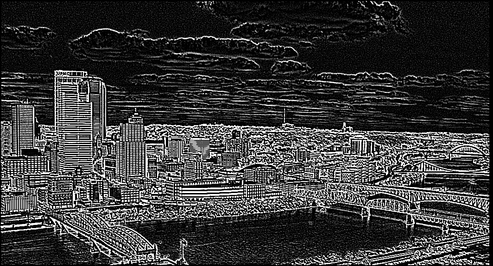
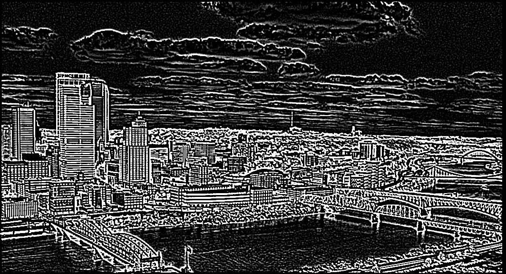
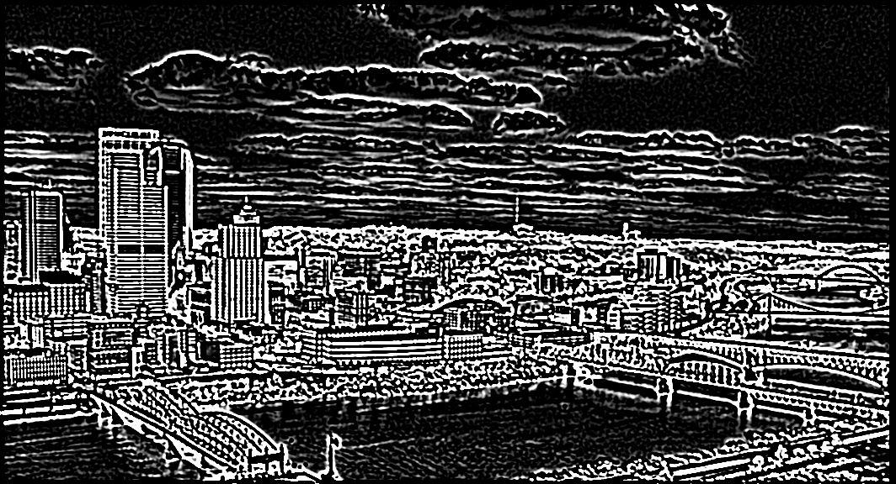
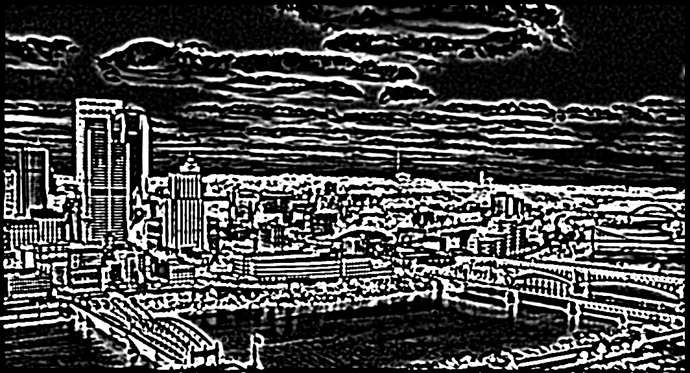
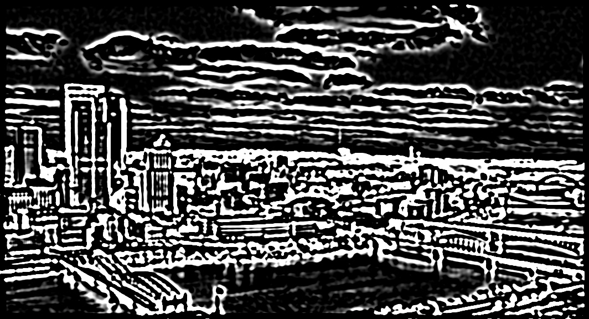
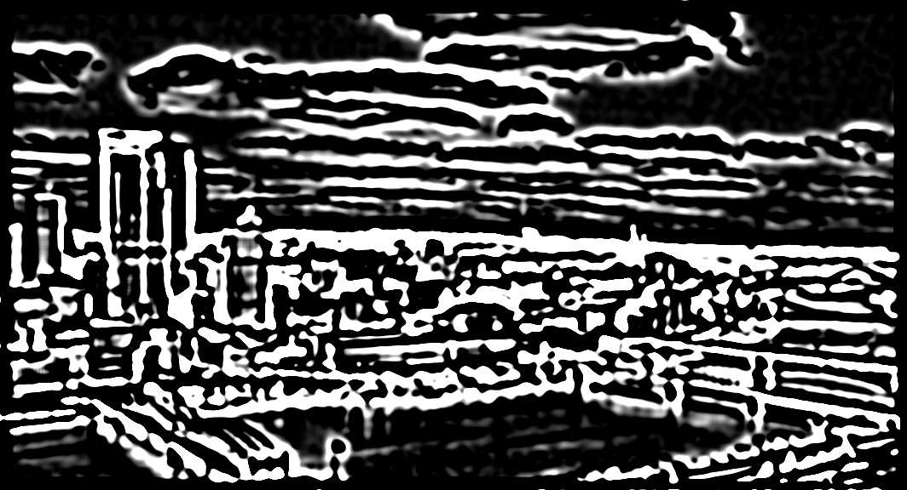
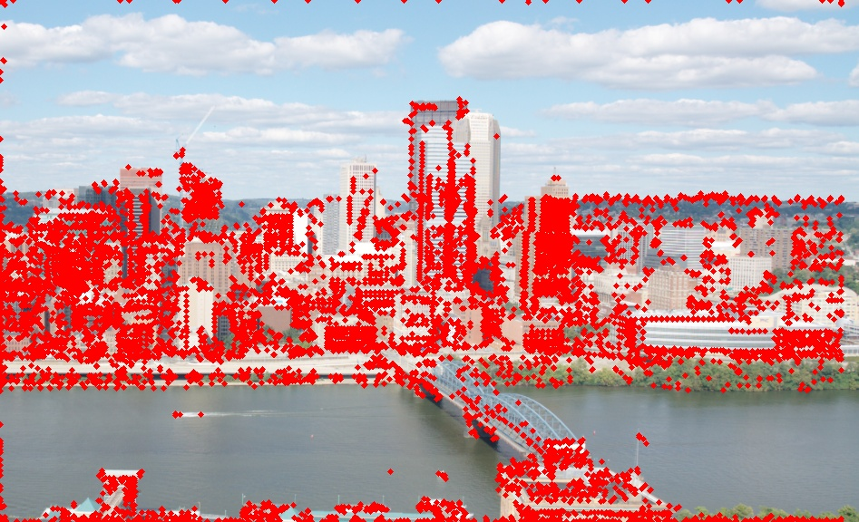
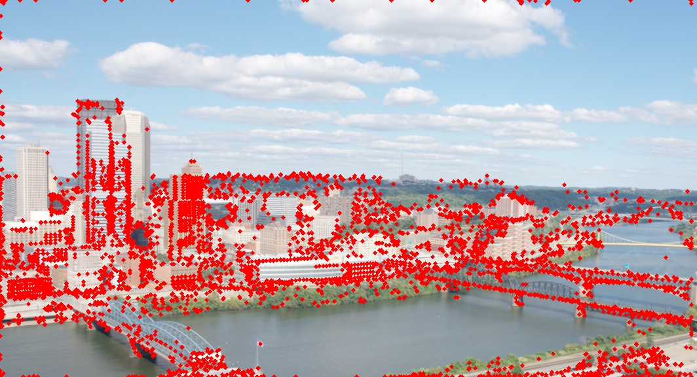
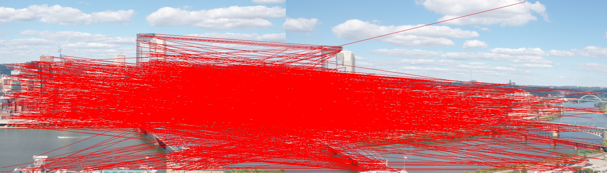

# Image Matching using keypoints

Parallel keypoint matching of 2 images using CUDA.

## Summary

The program consists of several stages:

1) Convolve a set of Gaussian filters on the image.

2) Build a Difference of Gaussian (GoD) pyramid.

3) Detect key points.

4) Compute Brief descriptors for key point.

5) Match key points in two images.

## Setup and Running
I also provide a Dockerfile file for setup setup

```bash
$ mkdir build && cd build
$ cmake .. && make -j12
$ cd ../bin && ./ImageMatching
```

Results:
```
Computing BRIEF for image ../data/incline_L.png
Detected 7814 key points
Output Gaussian Images
Output DoG Images
Output image with key points
Computing BRIEF for image ../data/incline_R.png
Detected 4767 key points
Output Gaussian Images
Output DoG Images
Output image with key points
Matching key points: ../data/incline_L.png, ../data/incline_R.png
cudaBriefMatch done
spwan 7321 threads in 15 threaded blocks
Number of matching keypoints: 1601
Output Match Image
Compute Gaussian Pyramid: 0.03
Compute DoG Pyramid: 0.03
Detect Keypoints: 0.06
Compute BRIEF Descriptor: 0.04
Match keypoint descriptors: 0.003061000000
```

## Background and Algorithm

Automated panoramic image stitching is an interesting topic in computer vision. It consists of an interest point detector, a feature descriptor. 

The entire algorithm can be broken down into several parallelizable stages, which are introduced in the following sections in detail. The two input images for matching used in our algorithm introduction are shown in the following figure.

<table>
  <tr>
    <td></td>
    <td></td>
  </tr>
</table>

### Key Point Detection

Key points provide an efficient representation of the image. To find the key points, we convolve a set of Gaussian filters on the image to produce a Gaussian Pyramid. The Gaussian pyramid of the example input image is shown in the following figure.

<table>
  <tr>
    <td></td>
    <td></td>
    <td></td>
    <td></td>
    <td></td>
    <td></td>
  </tr>
</table>

Then we obtain the Difference of Gaussian (DoG) by subtracting adjacent levels of the Gaussian Pyramid.  Points whose DoG values satisfy certain criteria are considered as key points. The difference of Gaussian and the detected key points for the example image is shown in the following two figures.

<table>
  <tr>
    <td></td>
    <td></td>
    <td></td>
    <td></td>
    <td></td>
    <td></td>
  </tr>
</table>

<table>
  <tr>
    <td></td>
    <td></td>
  </tr>
</table>


### Feature Descriptor

Feature descriptor characterizes the local information about an interest point. I used BRIEF (Binary Robust Independent Elementary Features) as our choice of descriptor. 

BRIEF considers an image patch around a key point, selects a set of location pairs in the image patch, and compares the intensity values of these location pairs. For example, X and Y are two locations, p(X) and p(Y) represent their intensity values, then the comparison result is 1 if p(X) < p(Y), 0 otherwise.

I randomly sample 256 pairs of locations in a 9 x 9 grid using a Gaussian distribution centered around the origin, and freeze this set to calculate the BRIEF descriptors. In this way, each key point is described using 256 values, each value specifying the comparison result of one of the 256 pairs. The following figure shows the visualization of sampled locations, where each line connects a location pair.


### Matching Key Points

I then match key points using the distance of their BRIEF descriptors. Hamming distance, i.e. the number of positions where two descriptors differ, is used as the distance metric. Given the descriptors of two images, we find the best matching point in the second image for each key point in the first image. The pseudo code for matching key point is shown as follows.

```c++
for p1 in image1.keypoints:
    float min = MAX_FLOAT;
    float second_min = MAX_FLOAT;
    Keypoint best_match = NULL;
    for p2 in image2.keypoints:
        float d = dist(p1.descriptor, p2.descriptor);
        if d < min
           second_min = min;
           min = d;
           best_match = p2;
        else if d < second_min
           second_min = d;
    if min / second_min < 0.8
    	add (p1, best_match) to matching key point pairs
```


Find both the minimum and the second minimum distance between the descriptor to be matched and some other descriptor in the second image. To reduce the likelihood of incorrect matching, we only consider the matching as valid if the difference between the minimum distance and second minimum distance is large enough. The matched key points between Fig 1(a) and Fig 1(b) are shown in the following figure.




## Approaches

### Technologies and Target Machines

C++ and CUDA for programming. In specific, the application is targeted for machine with Nvidia GPU. I develop our application on machines with NVIDIA GeForce RTX 3060, which supports CUDA compute capability 6.1.


### Gaussian Pyramid Computation

The convolution in Gaussian pyramid computation was performed by iterating over each pixel in the image and computing the weighted sum of the local neighborhood of the pixel. This computation fits naturally with the data-parallel model of CUDA, so we choose to parallelize within each image. I spawn a threaded-block with the size of the image, and each thread in the block performs the convolution for a single pixel. I synchronize the CUDA threads at the end of the computation of Gaussian Pyramid.

### Key Point Matching

#### Algorithmic Optimization of Key Point Matching

The key point matching process uses the hamming distance between two BRIEF descriptors as the distance metric. For each key point in image 2, the algorithm finds its closest key point in image 1. In our baseline sequential implementation, a BRIEF descriptor is implemented as a vector of 256 integers with 0/1 values. Therefore, comparing two descriptors needs to iterate over the vector, which is very time-consuming.

## Considerations
1. Matching Keypoints for Similarity
- Higher Number of Matches: A higher number of matching keypoints generally indicates that the images are more similar. This can be used as a basic measure of similarity.
- Thresholding: You can set a threshold for the number of matches. If the number exceeds the threshold, the images can be considered similar. For example, if 80% of the keypoints match, the images might be considered similar enough.
2. Limitations
- Exact Duplicates: Two images with the exact same content might have a very high number of matching keypoints, but this alone doesn’t guarantee they are identical in every pixel. Image transformations (like rotation, scaling, or slight perspective changes) can still result in a high match but with a slightly different appearance.
- Different Content: Conversely, two completely different images might have some coincidental matching keypoints, especially if they share some common structures, but the number would generally be low.
- Lighting and Noise: Even slight changes in lighting, noise, or small distortions can reduce the number of matching keypoints between images that are otherwise very similar.
3. Improving the Comparison
- RANSAC Filtering: After keypoints are matched, techniques like RANSAC (Random Sample Consensus) can be used to filter out incorrect matches. This helps in identifying more robust matches and can be a better indicator of similarity.
- Descriptor Matching Quality: Instead of just counting the number of matches, you could also consider the quality of those matches (e.g., using the distance between descriptors) to better assess similarity.
- Combined Methods: Using the number of matches in combination with other metrics, such as image histograms, structural similarity index (SSIM), or pixel-wise comparison (if feasible), can provide a more comprehensive similarity measure.

## License

This project is licensed under the MIT License - see the [LICENSE.md](LICENSE.md) file for details
